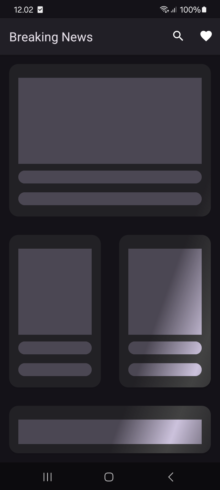

# 📢 NewsApp 📰  

An Android application that fetches and displays the latest news from **NewsAPI.org**.  
Built with **Kotlin** and **Android Studio**, the app uses **SQLite** for offline storage, **LoopJ** for networking, and **Facebook Shimmer** for a smooth loading effect.  

---

## 📸 Screenshots  

| Home & Search Screen | Loading State (Shimmer Effect) | Article Detail | Favorite |
|------------|--------------------|--------------|
|  |  |  |  |


---

## 🚀 Features  

✅ Fetch latest news from **NewsAPI.org**  
✅ Search news from **NewsAPI.org**  
✅ Use MVVM
✅ Favorite list can be access offline mode using **SQLite**  
✅ **LoopJ** library for efficient API calls  
✅ Smooth **Shimmer** loading effect  
✅ **Dark mode** support  

---

## 🛠 Tech Stack  

- **Kotlin**  
- **Android Studio**  
- **SQLite** (for local storage)  
- **LoopJ** (for REST API calls)  
- **Facebook Shimmer** (for skeleton loading effect)  

---

## 📦 Installation  

### Prerequisites  

1️⃣ Android Studio (latest version)  
2️⃣ An API key from [NewsAPI.org](https://newsapi.org)  

### Setup & Run  

```bash
# Clone the repository
git clone https://github.com/zakiburnama/News-App-API.git

# Open in Android Studio and build the project
